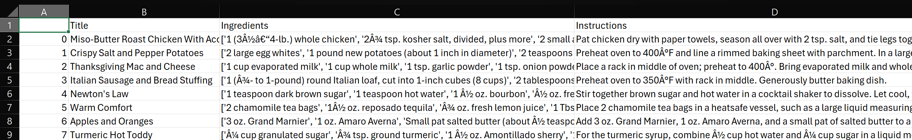

# Backend Documentation

## Overview

**RecipeGen (Backend)** is a lightweight FastAPI service that recommends recipes based on user provided ingredients. It combines **TF-IDF** text retrieval (title + ingredients + instructions) with a **pantry aware Jaccard similarity** and simple re ranking to return relevant, interpretable results. A small ETL step converts messy CSVs into a clean Parquet dataset that the API loads at startup.

### Key Features

- **Hybrid scoring**: TF-IDF bigrams + pantry aware Jaccard. 
  Includes an optional penalty for weak overlaps, per item coverage, and explicit lists of matched vs. missing tokens.

- **Robust data normalization**: Aggressive ingredient cleaning handles units, quantities, Unicode fractions, plural forms, and common canonicalization.

- **Operational readiness**: Health probes (`/health`, `/ready`), capped response sizes, configurable CORS, and defensive startup with clear logging.

- **Self-contained ETL**: CSV → normalized Parquet with derived fields (`ingredients_text`, `search_text`) and a JSON stats report.

### Tech Stack

- **Python**, **FastAPI**, **pydantic**

- **pandas**, **scikit-learn (TfidfVectorizer, linear_kernel)**, **numpy**

- Parquet I/O via **pyarrow**

---

## Project Structure

The backend is organized into a small number of clear modules:

```
.
├─ app/
│  ├─ main.py           # FastAPI app: API routes, scoring logic, service state
│  └─ utils.py          # Ingredient/title normalization, token cleanup, regex helpers
│
├─ scripts/
│  └─ etl_clean.py      # ETL script: converts raw CSV → normalized Parquet
│
├─ data/
│  ├─ raw/              # Original datasets (CSV format)
│  └─ processed/        # Cleaned data (recipes.parquet) consumed by the API
│
├─ Dockerfile.api       # Docker build for the backend service
├─ requirements.txt     # Python dependencies
└─ docs/                # Documentation files (backend doc, deployment notes, etc.)
```

- **`app/`**: Core backend service, including the FastAPI application and text normalization utilities.

- **`scripts/`**: Stand-alone utilities such as the ETL cleaner.

- **`data/`**: Raw and processed datasets. Only the Parquet file in `processed/` is required at runtime.

- **`Dockerfile.api`**: Defines a slim Python 3.11 image with dependencies and processed data baked in.

- **`requirements.txt`**: All Python dependencies for local development and container builds.

- **`docs/`**: Project documentation, split by topic (backend notes, deployment notes, etc.).

---

## Data Preparation

Raw recipes are taken from the [Recipe Dataset by josephrmartinez](https://github.com/josephrmartinez/recipe-dataset), which provides CSV files containing recipe titles, ingredients, and instructions (along with some extra columns such as `Image_Name` or `Cleaned_Ingredients`).

The backend does not consume the raw CSVs directly. Instead, a preprocessing step converts them into a normalized **Parquet** file that the API can load efficiently at startup.

### Raw Data Example

The raw dataset comes as CSV with m



---

### Processed Data Example

After running `scripts/etl_clean.py`, the dataset is normalized and saved as `data/processed/recipes.parquet`.

```tex
id                                                                  0
title               Miso-butter roast chicken with acorn squash pa...
ingredients         [whole_chicken, kosher_salt, acorn_squash, sag...
instructions        Pat chicken dry with paper towels, season all ...
ingredients_text    whole_chicken,kosher_salt,acorn_squash,sage,ro...
search_text         Miso-butter roast chicken with acorn squash pa...
Name: 0, dtype: object
```

### ETL Script (`scripts/etl_clean.py`)

The `etl_clean.py` script performs the following tasks:

1. **ID normalization**
   
   - Prefers an existing `id` column.
   
   - Falls back to `Unnamed: 0` if present.
   
   - Otherwise generates sequential IDs.
   
   - Coerces IDs to `int64` and backfills missing values with row indices.

2. **Title normalization**
   
   - Strips/standardizes whitespace.
   
   - Ensures consistent casing (first character uppercase, rest lowercase).

3. **Ingredients parsing**
   
   - Accepts messy formats:
     
     - Python/JSON-style lists (`"['egg','milk']"`)
     
     - Comma- or semicolon-separated strings (`"egg, milk; sugar"`)
   
   - Normalizes each ingredient token using the rules in `app/utils.py` (removing units, quantities, plurals, stopwords, etc.).
   
   - Deduplicates tokens while preserving order.

4. **Filtering**
   
   - Drops recipes with fewer than **2 ingredients**.
   
   - Drops recipes with empty instructions.

5. **Derived fields**
   
   - `ingredients_text`: ingredients joined into a single comma-separated string.
   
   - `search_text`: concatenation of title + ingredients_text + first 1000 chars of instructions (used for TF-IDF).

6. **Persistence & stats**
   
   - Saves the cleaned dataset as `data/processed/recipes.parquet`.
   
   - Prints a JSON report with:
     
     - Rows in / rows out
     
     - Dropped rows count
     
     - Average number of ingredients

### Output Schema (`recipes.parquet`)

The processed file includes the following columns:

- **`id`**: Unique integer ID.

- **`title`**: Normalized recipe title.

- **`ingredients`**: List of normalized ingredient tokens.

- **`instructions`**: Cleaned instructions text.

- **`ingredients_text`**: Ingredients flattened into a comma-separated string.

- **`search_text`**: Combined text used for TF-IDF vectorization.

---

## API Documentation

This service exposes three endpoints:

- `GET /health` – **liveness** probe (process is up).

- `GET /ready` – **readiness** probe (data & model loaded).

- `POST /recommend` – recipe recommendations based on ingredients.

### `GET /health`

**Purpose:** Quick liveness check.

**Response (200)**

```json
{ "status": "ok", "ready": true }
```

---

### `GET /ready`

**Purpose:** Readiness (TF-IDF vectorizer and dataset loaded).

**Response (200)**

```json
{
  "ready": true,
  "rows": 13467
}
```

- `ready`: `true` only when data + vectorizer are initialized.

- `rows`: number of recipes loaded.

---

### `POST /recommend`

**Purpose:** Return top-K matching recipes for a list of ingredients.

**Request body**

```json
{
  "ingredients": ["egg", "milk"],
  "k": 2
}
```

**Model**

- `ingredients` (array<string>, required): free-text tokens; normalized server-side.

- `k` (int, optional): number of results to return; capped by server (see `K_MAX`).

**Response (200)**

```json
{
  "items": [
    {
      "id": 1882,
      "title": "Sheet-pan eggs",
      "ingredients": [
        "unsalted_butter_vegetable_oil",
        "egg",
        "milk",
        "kosher_salt",
        "black_pepper"
      ],
      "instructions": "Preheat oven to 350°F. Grease an 18x13.....",
      "score": 0.5132957859604894,
      "matched": [
        "egg",
        "milk"
      ],
      "missing": [],
      "coverage": 1
    },
    {
      "id": 9773,
      "title": "Cornflake fried chicken",
      "ingredients": [
        "chicken_breast",
        "egg",
        "milk",
        "cornflake",
        "vegetable_oil"
      ],
      "instructions": "Pound chicken between 2 sheets of plastic.....",
      "score": 0.39464782648698316,
      "matched": [
        "egg",
        "milk"
      ],
      "missing": [],
      "coverage": 1
    }
  ],
  "low_confidence": false
}
```

**Field notes**

- `score`: combined TF-IDF (bigrams) + pantry-aware Jaccard, with an optional penalty for low overlap.

- `matched` / `missing`: computed over **non-pantry** tokens (e.g., salt/oil ignored by default).

- `coverage`: fraction of **non-pantry** query tokens that appear in the recipe (0–1).

- `low_confidence`: `true` when top result’s coverage is below a configurable threshold or no candidates.

**Errors**

- `400 Bad Request` – empty/invalid `ingredients` after normalization.
  
  ```json
  { "detail": "Provide at least one valid ingredient." }
  ```

- `503 Service Unavailable` – service not ready (dataset/vectorizer not loaded yet).
  
  ```json
  { "detail": "Service not ready. Try again soon." }
  ```

---

## Data Flow & Logic

This section explains what happens from the moment a request arrives to the moment results are returned.

### 1) Request → Normalization

1. Client sends:
   
   ```json
   { "ingredients": ["chicken", "garlic", "onion"], "k": 3 }
   ```

2. Server **normalizes & dedupes** the list using `utils.normalize_ingredient`:
   
   - strips units/quantities/unicode fractions
   
   - folds plurals, removes stopwords
   
   - canonicalizes common variants 
     Result (example): `["chicken", "garlic", "onion"]`.

### 2) Query Vectorization (TF-IDF)

3. Join tokens: `q_text = "chicken garlic onion"`.

4. Transform with `TfidfVectorizer(analyzer="word", ngram_range=(1,2), min_df=2, max_df=0.8)` built at startup over `search_text`.

5. Compute cosine similarities via `linear_kernel(qv, state.tfidf)` → `sims`.

### 3) Candidate Set

6. Take top **N** by TF-IDF similarity (`TOPK_CAND` cap) → `top`.

### 4) Pantry-Aware Jaccard + Re-scoring

7. For each candidate `i`:
   
   - Coerce recipe ingredients with `_coerce_ingredients`.
   
   - **Pantry-aware sets**:
     
     - `qa` = non-pantry query tokens
     
     - `da` = non-pantry recipe tokens
   
   - **Jaccard**:
   
   - **Hybrid score**:
   
   - **Low-overlap penalty** (optional):
     
     - if `|qa ∩ da| < MIN_OVERLAP` → `score_i *= PENALTY_LOW_OVERLAP`
   
   - **Coverage** (reported per item):
   
   $$
   \text{coverage}_i =
\begin{cases}
0 & \text{if } |qa| = 0 \\
\dfrac{|qa \cap da|}{|qa|} & \text{otherwise}
\end{cases}
   $$

### 5) Sorting & Truncation

8. Sort candidates by **score** (desc).

9. Take top-`k` (clamped to `1…K_MAX`).

### 6) Result Construction

10. For each returned recipe:
- `matched` = sorted `qa ∩ da`

- `missing` = sorted `qa \ da`

- Include `score`, `coverage`, normalized `ingredients`, and original `instructions`.

### 7) Confidence Heuristic

11. `low_confidence = true` if:
- there are no scored items, **or**

- the best item’s `coverage < COVERAGE_LOW`.

---

### Fallbacks & Defensive Behavior

- **`search_text` fallback**: If the Parquet lacks `search_text`, it’s constructed at startup as:
  
  ```
  title + " " + normalized_ingredients + " " + instructions[:1000]
  ```
  
  (lower-cased), with a warning in logs.

- **Readiness vs. liveness**: `/ready` returns false until Parquet is read and TF-IDF is fitted; `/health` remains up for process liveness.

- **Input guardrails**: empty/invalid ingredients → `400`; service not ready → `503`.

- **Runtime caps**: `TOPK_CAND` (candidate pool) and `K_MAX` (returned items) protect CPU/time.

---

### Pseudocode (high level)

```python
tokens = normalize_and_dedupe(req.ingredients)
if not tokens: 400

qv = vec.transform([" ".join(tokens)])
sims = cosine(qv, tfidf)
cands = argsort_desc(sims)[:TOPK_CAND]

scored = []
for i in cands:
    ings = coerce(recipe[i].ingredients)
    qa, da = non_pantry(tokens), non_pantry(ings)
    j = jaccard(qa, da)
    score = W_TFIDF*sims[i] + W_JACCARD*j
    if overlap(qa, da) < MIN_OVERLAP:
        score *= PENALTY_LOW_OVERLAP
    coverage = 0 if not qa else overlap(qa, da)/len(qa)
    scored.append((i, score, coverage))

items = build(sorted(scored, key=score, reverse=True)[:k_clamped])
low_confidence = (not scored) or (items[0].coverage < COVERAGE_LOW)
return { "items": items, "low_confidence": low_confidence }
```

```
Request → Normalize → TF-IDF Similarity → Top-N Candidates
        → Pantry-Aware Jaccard + Penalty → Sort by Score → Top-k Results
```

---

## Containerization

The backend is fully containerized via `Dockerfile.api`. 
The image is based on **python:3.11-slim**, installs dependencies from `requirements.txt`, and bundles the processed dataset (`recipes.parquet`) into the container.  

Key points:

- Exposes port **8000** (FastAPI / Uvicorn).

- Starts the app with:  
  
  ```bash
  uvicorn app.main:app --host 0.0.0.0 --port 8000
  ```

For detailed build/run instructions, see the **backend-deployment-notes.md** file.

---

## Testing Demo (Video)

For a quick walkthrough of the backend in action, watch the short demo video here:

▶️ [RecipeGen Backend Testing Video](https://drive.google.com/drive/folders/1CwIQnM3LIAYxKux7YONo1QjIUTFU7lVS?usp=sharing)

The video covers:

- Starting the backend container with Docker
- Exploring the API via Swagger UI (`/docs`)
- Running health and readiness checks (`/health`, `/ready`)
- Sending a sample recommendation request to `/recommend`
- Viewing the response with recipe titles, scores, and matched/missing tokens


